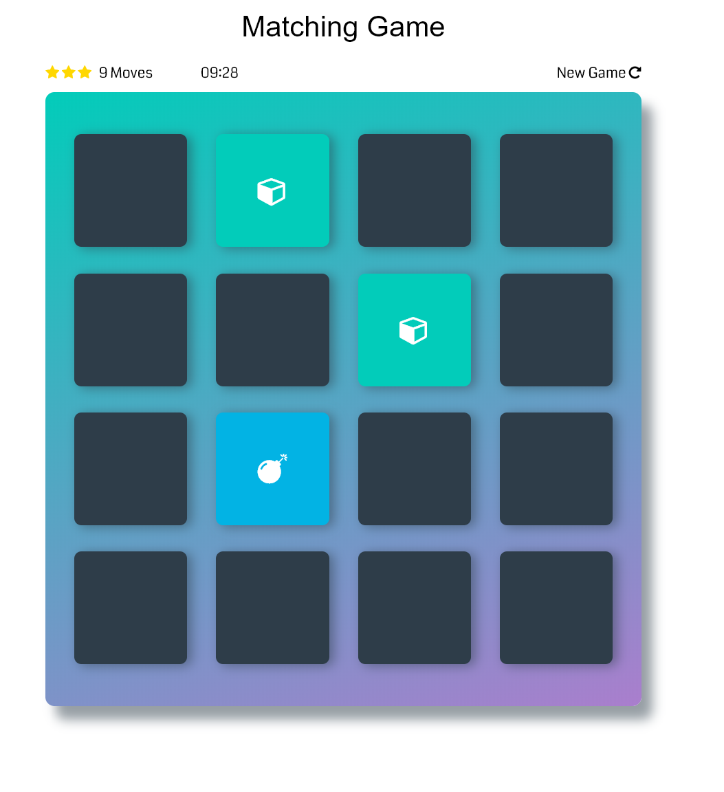

# Memory Game Project

## Table of Contents

* [Motivation](#motivation)
* [Description](#description)
* [Tools](#tools)
* [Files](#files)
* [Installation](#installation)
* [Result](#result)
* [Instructions](#instructions)
* [Contributing](#contributing)

## Motivation

The Memory game is the project of Udacity Front-End Web Development Nanodegree.

## Description

This is a memory game. The object of the game is to turn over pairs of matching cards.
To start new game, press 'New Game' button.

## Tools

This game was build with:
 [jQuery3.3.1](https://ajax.googleapis.com/ajax/libs/jquery/3.3.1/jquery.min.js)
 [Font Awesome4.6.1](https://maxcdn.bootstrapcdn.com/font-awesome/4.6.1/css/font-awesome.min.css)
 [HTML](https://developer.mozilla.org/en-US/docs/Glossary/HTML),
 [JavaScript](https://developer.mozilla.org/en-US/docs/Web/JavaScript),
 [CSS](https://developer.mozilla.org/en-US/docs/Glossary/CSS),
 [jQuery](https://developer.mozilla.org/en-US/docs/Glossary/jQuery)

## Files

This game consists from 3 files:
- index.html
- app.js
- app.css

## Installation

In order to play this game, please open index.html file in Google Chrome browser and play.

## Instructions

* Open index.html in Google Chrome browser
* Click any card
* Click on the second card
* Try to open a matching card

## Result

After finishing game you'll see congratulations modal with number of moves and time you've spent to open all cards.

## Contributing

This repository is the starter code for _all_ Udacity students. Therefore, we most likely will not accept pull requests.

For details, check out [CONTRIBUTING.md](CONTRIBUTING.md).
